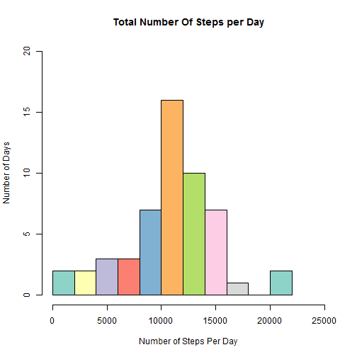
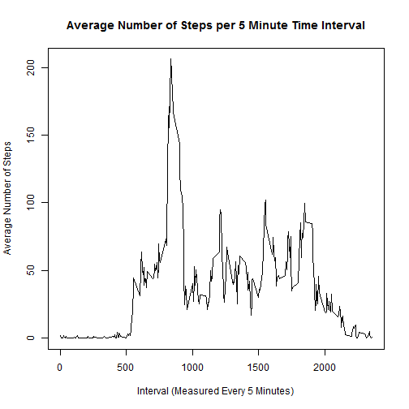
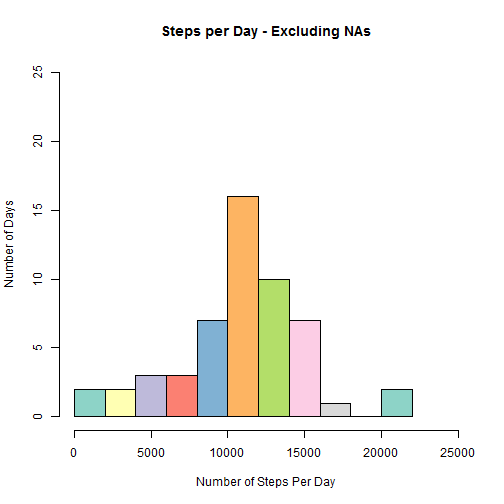
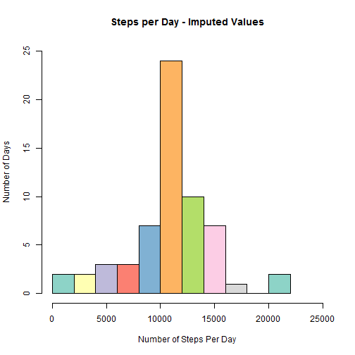
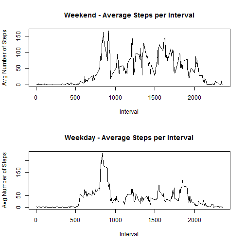

Reproducible Research Project 1
===============================


##Load the data, filter out missing values, and calculate the total number of steps per day


```r
###change to the working directory of project1
setwd("~/RepData_PeerAssessment1")

#Validate we have the activity file
if(!file.exists("activity.csv") )
    unzip('activity.zip')

org_data <- read.csv("activity.csv", header=TRUE, na.strings = "NA")

#format dates to POSIXct
org_data$date <- ymd(org_data$date)

#Add a column with the day of the week for the observations given date
org_data$dayofweek <- weekdays.POSIXt(org_data$date)

#Filter out missing data
filteredData <- org_data[which(complete.cases(org_data)),]

#We are already using filtered data without NAs
#Calculate the total number of steps taken per day
agg_sum <- aggregate(filteredData$steps ~ filteredData$date , FUN = sum)
names(agg_sum) <- c("date", "steps")
```


###Histogram of the total number of steps taken each day


```r
par(mfrow = c(1,1))

hist(agg_sum$steps, 
     breaks = 10, 
     col = brewer.pal(n = 10, name = "Set3"),
     xlab = "Number of Steps Per Day", 
     ylab = "Number of Days", 
     main = "Total Number Of Steps per Day",
     xlim = c(0,25000),
     ylim = c(0,20)
)
```




##Calculate and report the mean and median of the total number of steps taken per day
###What is mean total number of steps taken per day?

```r
mean(agg_sum$steps)
```

```
## [1] 10766.19
```

###What is the median number of steps?

```r
median(agg_sum$steps)
```

```
## [1] 10765
```


###What is the average daily activity pattern?
This is a time series plot of the 5-minute interval (x-axis) and the average number of steps taken, averaged across all days (y-axis)

```r
avg_steps_interval <- aggregate(filteredData$steps ~ filteredData$interval, FUN=mean)
names(avg_steps_interval) <- c("interval", "steps")
par(mfrow=c(1,1))

plot(x = avg_steps_interval$interval, y = avg_steps_interval$steps, type = "l",
     xlab="Interval (Measured Every 5 Minutes)", ylab="Average Number of Steps",
     main = "Average Number of Steps per 5 Minute Time Interval" 
     )
```




###Which 5-minute interval, on average across all the days in the dataset, contains the maximum number of steps?

```r
maxInterval <- avg_steps_interval[avg_steps_interval$steps == max(avg_steps_interval$steps),]
maxInterval
```

```
##     interval    steps
## 104      835 206.1698
```
The conversion of minutes to time for the max value is as follows:  (Assumes the device's clock 0 is equal to midnight)

```r
strftime( as.Date(Sys.time()) + minutes(maxInterval$interval), "%H:%M"  )
```

```
## [1] "13:55"
```

###Missing Data Analysis and Comparisons

```r
totalObservations <- nrow(org_data)
missingValues <- nrow(org_data[is.na(org_data),])
missingValues
```

```
## [1] 2304
```

For missing data, I have imputed the data for missing values by using the mean number of the steps for a given interval from the known data set


```r
new_data <- org_data

for(i in 1:nrow(new_data))  # for each row in completed data set with NA's
{
    if (  is.na(new_data$steps[i]) )
        new_data$steps[i] <- as.integer( avg_steps_interval$steps[avg_steps_interval$interval == new_data$interval[i]] )
}

agg_sum_imputed <- aggregate(new_data$steps ~ new_data$date, FUN=sum)
names(agg_sum_imputed) <- c("date", "steps")
```
###Side by side comparsion of the data with NAs removed vs NAs being imputed


```r
#Histograms showing both Missing data removed vs. Missing Data Imputed
hist(agg_sum$steps, 
     breaks = 10, 
     col = brewer.pal(n = 10, name = "Set3"),
     xlab = "Number of Steps Per Day", 
     ylab = "Number of Days", 
     main = "Steps per Day - Excluding NAs",
     xlim = c(0,25000),
     ylim = c(0,25)
)
```



```r
#Imputed Data
hist(agg_sum_imputed$steps, 
     breaks = 10,
     col = brewer.pal(n = 10, name = "Set3"),
     xlab = "Number of Steps Per Day", 
     ylab = "Number of Days", 
     main = "Steps per Day - Imputed Values",
     xlim = c(0,25000),
     ylim = c(0,25)
)
```




```
## [1]    41 21194
```
###Mean of the imputed data

```r
mean(agg_sum_imputed$steps)
```

```
## [1] 10749.77
```
###Median number of steps of the imputed data

```r
median(agg_sum_imputed$steps)
```

```
## [1] 10641
```

###Do these values differ from the estimates from the first part of the assignment? 
Both the mean and median are impacted.

(Missing data mean -> 10766.19 ) - (Imputed Data mean -> 10749.77 ) == 16.41951

(Missing data median -> 10765 )  - (Imputed Data median -> 10641 )  == 124

###What is the impact of imputing missing data on the estimates of the total daily number of steps?
The impact of imputing the data reduced both the average and middle values.  

For the mean, its   .1525099 % change

For the median, its 1.151881 % change

###Are there differences in activity patterns between weekdays and weekends?

```r
#Created a factor variable for calculating differences between the weekdays and weekends.
Weekday <- c("Monday", "Tuesday", "Wednesday", "Thursday", "Friday")
Weekend <- c("Saturday", "Sunday")

###Assign the correct weekday/weekend factor based-off the defined weekday in the data frame
new_data$day <- ifelse(new_data$dayofweek %in% Weekday,"Weekday", "Weekend")

weekend_avg_steps_interval <- aggregate(steps ~ interval ,data = new_data, subset = day == "Weekend", FUN=mean)
names(avg_steps_interval) <- c("interval", "steps")

weekday_avg_steps_interval <- aggregate(steps ~ interval ,data = new_data, subset = day == "Weekday", FUN=mean)
names(avg_steps_interval) <- c("interval", "steps")
```

###This is a panel plot showing the average number of steps taken, averaged across all weekday days or weekend days.


```r
par(mfrow = c(2, 1))
plot(x = weekend_avg_steps_interval$interval, 
     y = weekend_avg_steps_interval$steps, 
     xlab = "Interval", 
     ylab="Avg Number of Steps", 
     main = "Weekend - Average Steps per Interval" , 
     type = "l"
 )
plot(x = weekday_avg_steps_interval$interval, 
     y = weekday_avg_steps_interval$steps, xlab = "Interval", 
     ylab="Avg Number of Steps", 
     main = "Weekday - Average Steps per Interval" ,
     type = "l"
 )
```


